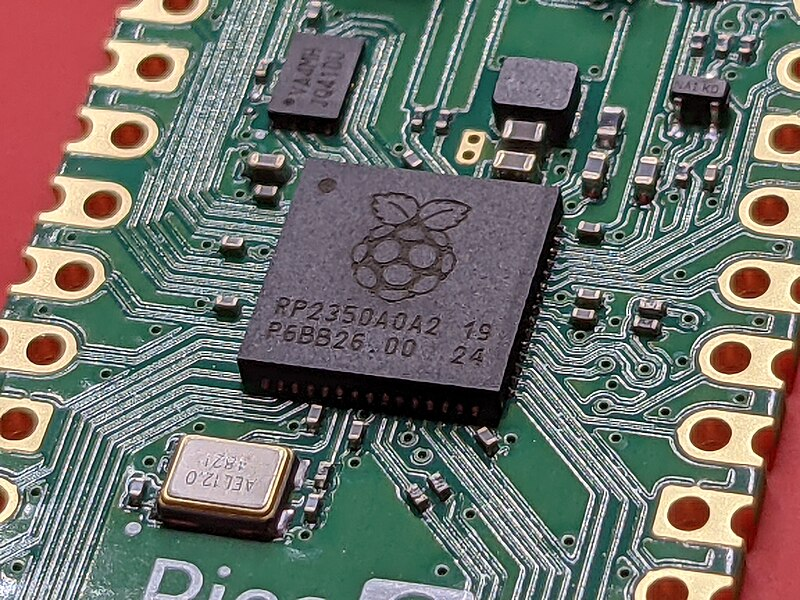

# Lecture - 11/09/2025

Content taught: Apresentação da ementa. Introdução aos sistemas
embarcados, microcontroladores, conceitos e fundamentos.

## Ementa da Disciplina

**Curso:** Curso Superior de Tecnologia em Sistemas para Internet
**Disciplina:** Sistemas Embarcados **Carga-Horária:** 60h (80h/a)
**Pré-Requisito(s):** Sistemas Digitais **Número de créditos:** 4

<div class="center">

EMENTA

</div>

Aspectos relacionados ao desenvolvimento de sistemas embarcados.

<div class="center">

PROGRAMA

</div>

<div class="center">

Objetivos

</div>

Conhecer técnicas e ferramentas para desenvolvimento de Sistemas
Embarcados.

<div class="center">

Bases Científico-Tecnológicas (Conteúdos)

</div>

- 1\. Introdução

  - 1.1. Histórico e evolução;

  - 1.2. Características;

  - 1.3. Aplicações típicas;

  - 1.4. Tecnologias e Arquiteturas;

  - 1.5. Projeto e Modelagem de Sistemas Embarcados.

- 2\. Hardware

  - 2.1. Introdução aos microprocessadores e microcontroladores;

  - 2.2. Dispositivos de Entrada e Saída;

  - 2.3. Sensores;

  - 2.4. Atuadores;

  - 2.5. Interfaces de Comunicação.

- 3\. Programação

  - 3.1. Ambientes de Desenvolvimento;

  - 3.2. Principais SOs para Sistemas Embarcados;

  - 3.3. Desenvolvimento de Sistemas Embarcados;

  - 3.4. Conectividades;

  - 3.5. Programação concorrente: Conceitos de concorrência, problema de
    exclusão mútua, comunicação e sincronização em memória compartilhada
    e por troca de mensagens;

  - 3.6. Escalonamento em projetos de sistemas embarcados;

  - 3.7. Segurança.

<div class="center">

Procedimentos Metodológicos

</div>

Aulas expositivas; aulas práticas, estudos dirigidos; seminários;
vídeos; dinâmicas de grupo; visitas técnicas; palestras.

<div class="center">

Recursos Didáticos

</div>

Quadro branco e pincel; computador; internet; projetor de multimídia.

<div class="center">

Avaliação

</div>

Trabalhos práticos; apresentação de seminários; relatórios; avaliação
escrita e prática.

<div class="center">

Bibliografia Básica

</div>

- 1\. ALMEIDA, Rodrigo de; MORAES, Carlos; SERAPHIM, Thatyana.
  Programação de Sistemas Embarcados. Editora Elsevier. 2016.

- 2\. DENARDIN, Gustavo Weber; BARRIQUELLO, Carlos Henrique. Sistemas
  Operacionais de Tempo Real e sua Aplicação em Sistemas Embarcados.
  Editora Blucher. 2019.

- 3\. JUNIOR, Sérgio Luiz Stevan; SILVA, Rodrigo Adamshuk. Automação e
  Instrumentação Industrial com Arduino: Teoria e Projetos. Editora
  Érica. 2015.

<div class="center">

Bibliografia Complementar

</div>

- 1\. YIU, Joseph. The Definitive Guide to ARM® Cortex®-M3 and
  Cortex®-M4 Processors. 3. ed. Newnes. 2013.

- 2\. TOULSON, Rob; WILMSHURST, Tim. Fast and Effective Embedded Systems
  Design: Applying the ARM mbed. Editora Newnes. 2016.

- 3\. JUCA, Sandro; PEREIRA, Renata. Aplicações Práticas de sistemas
  embarcados Linux utilizando Raspberry Pi. Editora PoD. 2018.

- 4\. GU, Changyi. Building Embedded Systems: Programmable
  Hardware.Editora: Apress. 2016.

- 5\. BERGER, Arnold S. Embedded Systems Design: An Introduction to
  Processes, Tools, and Techniques. Editora CMP Books. 2017.

<div class="center">

Software(s) de Apoio:

</div>

- Linguagem de Programação;

- IDE - Ambiente de Desenvolvimento Integrado.

## Introdução aos sistemas embarcados

Um sistema embarcado é:

– Michael Barr

Exemplos de sistemas embarcados são:

– Michael Barr

## Introdução a microcontroladores

Um microcontrolador é:

– Michael Barr

<figure id="fig:rp2305">

<figcaption><span id="fig:rp2305" label="fig:rp2305"></span>This is the
RP2350 microcontroller chip seen in the circuit board of a Raspberry Pi
Pico 2.</figcaption>
</figure>

## Conceitos e fundamentos

...

# Lecture - 15/09/2025

Content taught: Conceitos básicos sobre sistemas embarcados - entradas
digitais.

## Entradas Digitais

...

# Lecture - 18/09/2025

Content taught: Introdução à programação de microcontroladores em
linguagem C: tipos de dados; tabela ASCII e sistema binário;
configuração de GPIO.

## Introdução à programação de microcontroladores em linguagem C

...

### Tipos de dados

...

### Tabela ASCII e Sistema Binário

...

### Configuração de GPIO

...

# Lecture - 22/09/2025

Content taught: Manipulando saídas digitais: Acionamento de LED;
corrente máxima nos pinos; cálculo da resistência limitadora. Prática
rápida: Implementação de um circuito de sinalização de entrada e saída
de veículos. Interface entre circuitos digitais e cargas de alta
potência utilizando transistores: Transistor como chave eletrônica;
Acionamento de motores CC.

## Manipulando saídas digitais

...

### Acionamento de LED

...

### Corrente máxima nos pinos

...

### Cálculo da resistência limitadora

...

### Prática rápida

...

#### Implementação de um circuito de sinalização de entrada e saída de veículos

...

#### Interface entre circuitos digitais e cargas de alta potência utilizando transistores

...

#### Transistor como chave eletrônica

...

#### Acionamento de motores CC

...

# Lecture - 25/09/2025

Content taught: Programação de microcontroladores: temporização. Funções
delay() e millis(). Espera ocupada.

## Programação de microcontroladores: Temporização

...

### Função delay()

...

### Função millis()

...

### Espera ocupada

...

# Lecture - 29/09/2025

Content taught: Prática sobre acinamento de cargas utilizando
transistores. Os alunos tiveram um primeiro contato com o laboratório de
eletrônica, onde montaram um circuito simples de ativação de uma
ventoinha por meio do chaveamento de um transistor de potência. O
intuito da aula foi preparar a turma para futuras práticas de
acionamento utilizando programação e transistores. Trabalhou-se a
competência de se interpretar um esquema eletrônico, bem como de criar
novos arranjos de acordo com uma necessidade específica.

## Prática sobre acinamento de cargas utilizando transistores

...

# Lecture - 02/10/2025

Content taught: Programação com temporização: função millis().

## Programação com temporização: função millis()

...

# Lecture - 06/10/2025

Content taught: Exercícios sobre entradas digitais, saídas, resistores
de pull-lup, pull-down, projeto de sistemas digitais utilizando arduino;
Utilização dos operadores lógicos da linguagem C.

## Exercícios

...

### Entradas digitais

...

### Saídas digitais

...

### Resistores de pull-up

...

### Resistores de pull-down

...

### Projeto de sistemas digitais utilizando arduino

...

### Utilização dos operadores lógicos da linguagem C

...

# Lecture - 09/10/2025

Content taught: Programação com temporização: função millis().
Aplicações.

## Programação com temporização: função millis(). Aplicações

...

# Lecture - 13/10/2025

Content taught: Acionamento de cargas utilizando relé: Princípio de
funcionamento dos relés eletromecânicos; simbologia; exemplo de
aplicação.

## Acionamento de cargas utilizando relé eletromecânicos

...

### Princípio de funcionamento

...

### Simbologia

...

### Exemplo de aplicação

...

# Assignment - 17/10/2025

Assignment Description: Considerando o contexto da aula do dia 13/10,
que tratou sobre os relés, faça o que se pede nos itens abaixo:

**1. Implemente um código simples que inverte o estado da lâmpada caso
um botão seja pressionado.**

- Seguir esquema mostrado em aula;

- Materiais utilizados: Arduino Uno, pushbutton, relé SPDT, resistor,
  diodo, lâmpada incandescente, transistor NPN e bateria de 9V.

**2. Envie o link da simulação.**

## Código em C++

``` c
// atribuição dos pinos
const int btn_pin = 2;
const int tst_pin = 3;

// atribuindo timestamp inicial
unsigned long millisNow = millis();
unsigned long lastMillis = millis();

// função para ler botão
void readButton(int time){
  millisNow = millis();
  if (millisNow - lastMillis >= time){
    digitalWrite(tst_pin, !digitalRead(tst_pin));
    lastMillis = millisNow;
  }
}

// configuração incial
void setup()
{
  pinMode(btn_pin, INPUT);
  pinMode(tst_pin, OUTPUT);
  digitalWrite(btn_pin, LOW);
  digitalWrite(tst_pin, LOW);
}

// loop principal
void loop()
{
  if (digitalRead(btn_pin)){
    readButton(200); // duplo clique no intervalo de 200ms é considerado como um único clique
  }
}
```

# Simulado da 1ª avaliação - 20/10/2025

...

# Assignment - 23/10/2025

This assignment was aimed to reverse engineer the game called
[Genius](https://en.wikipedia.org/wiki/Simon_(game)) from the
traditional toy brazilian manufacturer
[Estrela](https://en.wikipedia.org/wiki/Estrela_(company)). Actually, as
I take these notes, just found that this game was actually
international.

Simon is a short term memory electronic game . It was patent under Ralph
H. Baer and Howard J. Morrison . The game loop is pretty simple,
according to Wikipedia:  
"The device creates a series of tones and lights and requires a user to
repeat the sequence. If the user succeeds, the series becomes
progressively longer and more complex. Once the user fails or the time
limit runs out, the game is over."

The full simulation for our recreation is available publicy at
[Tinkercad](https://www.tinkercad.com/things/5QbNWprTGky-genius-estrela?sharecode=emlPcyX6GBUJY967Q9LnX9mBZDVs0M2osP7Pup8dmDg).
Also, the [full
code](https://github.com/delellisc/embedded-systems/blob/master/genius-estrela/genius-estrela.ino)
written is available at this remote repository too.

<figure id="fig:simon-game">

<figcaption><span id="fig:simon-game" label="fig:simon-game"></span>This
is the Simon electronic game, also called Genius in Brazil.</figcaption>
</figure>

# Lecture - 30/10/2025

Content taught: Presentation of the updated version of last assignment.
Introduction to Analog Inputs.

Updated code:

``` cpp
int read_btn(int btn_pin){
    millisATUAL = millis();
        while(millisATUAL - millisANT <= 10000){
            millisATUAL = millis();
            if (digitalRead(btn_pin)){
                Serial.print("ACERTO");
                // returns 1 only when right
                return 1;
            }
            else if(
                btn_pin != btn_red && digitalRead(btn_red) ||
                btn_pin != btn_grn && digitalRead(btn_grn) ||
                btn_pin != btn_yel && digitalRead(btn_yel) ||
                btn_pin != btn_ble && digitalRead(btn_ble)
            ){
                Serial.print("ERRO\n");
                return 0;
            }
        }
    // returns 0 if no condition is met    
    return 0;
}
```

[Floating point number
arithmetic](https://en.wikipedia.org/wiki/IEEE_754)...

To represent floating point numbers, we need the least significant bit
to be less than 2 to the power of 0.

Arduino UNO has a resolution of 10 bits.

# LaTeX

I shall take notes with LaTeXand then convert them to Markdown. To
convert it into my README.md, I’ll just use the following:

``` bash
pandoc main.tex -o README.md --from=latex --to=gfm
```
